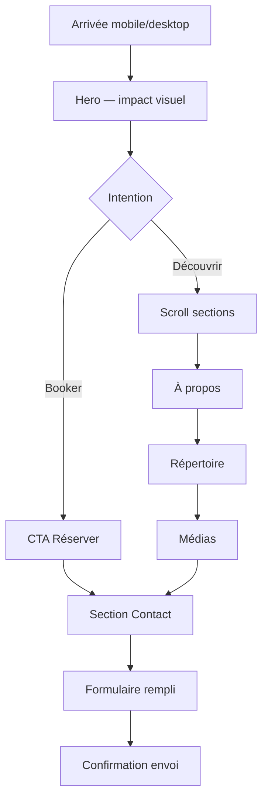

# Étape 2 — Wireframe (mobile first)

> Structure de la page unique pour **H8F4**, basée sur le brief et la direction **Dark Rock Energy** du benchmark.
> Le logo actuel est un asset interchangeable — le design ne lui est pas lié.
> Base de référence : **375 px** (mobile) → **768 px** (tablette) → **1280 px** (desktop).

---

## Vue d'ensemble

| Propriété | Valeur |
|---|---|
| Pages | 1 page (`index`) + page optionnelle `mentions-legales` |
| Framework cible | Astro + Tailwind CSS |
| Navigation | Header fixe + ancres + menu burger mobile |
| Sections | 6 blocs + footer |
| CTA principal | « Réserver le groupe » → `#contact` |

### Carte des ancres

```
#hero      → Accueil
#a-propos  → Le groupe
#repertoire → Répertoire
#medias    → Photos & vidéos
#contact   → Booking
```

---

## Tokens de mise en page

| Token | Mobile | Tablette | Desktop |
|---|---|---|---|
| Padding horizontal | 16 px | 24 px | 32 px |
| Max-width contenu | 100 % | 100 % | 1200 px (centré) |
| Hauteur header | 56 px | 64 px | 72 px |
| Espacement sections | 64 px | 80 px | 96 px |
| Rayon cartes | 8 px | 8 px | 12 px |
| Hauteur bouton CTA | 48 px | 48 px | 52 px |

### Palette (rappel benchmark)

| Rôle | Couleur |
|---|---|
| Fond page | `#0A0A0A` |
| Fond section alt | `#121212` |
| Surface carte | `#1A1A1A` |
| Bordure | `#2A2A2A` |
| Texte | `#F5F5F5` |
| Texte secondaire | `#A0A0A0` |
| Accent / CTA | `#FF6B35` |
| Accent hover | `#E63946` |

---

## Composants globaux

### Header (fixe, toutes tailles)

```
┌──────────────────────────────────────────┐  ← 56px, fond #0A0A0A 90% + blur
│ [LOGO]                          [≡]     │  ← logo 120px largeur mobile
└──────────────────────────────────────────┘
```

**Desktop (≥ 768 px)**

```
┌────────────────────────────────────────────────────────────┐
│ [LOGO]   Le groupe  Répertoire  Médias     [Réserver ▶] │
└────────────────────────────────────────────────────────────┘
```

| Élément | Comportement |
|---|---|
| Logo | `assets/logo-no-background.svg`, hauteur 32 px mobile / 40 px desktop |
| Menu burger | Ouvre un panneau plein écran avec les 5 ancres + CTA |
| Bouton « Réserver » | Visible dans le header desktop ; dans le menu mobile |
| Scroll | Header réduit légèrement (56 → 48 px) après 80 px de scroll |
| État actif | L'ancre de la section visible est soulignée en accent |

### Menu mobile (overlay)

```
┌──────────────────────────┐
│ [LOGO]              [✕]  │
├──────────────────────────┤
│                          │
│   Accueil                │
│   Le groupe              │
│   Répertoire             │
│   Photos & vidéos        │
│   Contact                │
│                          │
│ ┌──────────────────────┐ │
│ │  Réserver le groupe  │ │  ← pleine largeur, accent
│ └──────────────────────┘ │
│                          │
│   [Instagram] [Facebook] │
└──────────────────────────┘
```

- Fond `#0A0A0A`, animation slide-in 200 ms
- Fermeture : croix, clic lien, touche Échap
- Focus piégé dans le panneau (accessibilité)

### CTA sticky mobile (optionnel, recommandé)

```
┌──────────────────────────┐
│                          │
│      (contenu page)      │
│                          │
├──────────────────────────┤
│ [ Réserver le groupe  ]  │  ← barre fixe bas, 56px, visible après scroll hero
└──────────────────────────┘
```

- Masqué quand la section `#contact` est visible à l'écran
- `padding-bottom` du body = 56 px pour éviter le chevauchement

---

## Section 1 — Hero (`#hero`)

### Mobile (375 × ~667 viewport)

```
┌──────────────────────────┐
│░░░░░░░░░░░░░░░░░░░░░░░░░░│  ← image/vidéo live plein fond
│░░░░░░░░░░░░░░░░░░░░░░░░░░│     overlay gradient bas → #0A0A0A
│░░░░░░░░░░░░░░░░░░░░░░░░░░│     hauteur : 100svh (min 500px)
│░░░░░░░░░░░░░░░░░░░░░░░░░░│
│                          │
│      [LOGO large]        │  ← 80 % largeur, centré
│                          │
│  Du rock iconique,       │  ← tagline, Poppins 16px
│  live et sans compromis  │
│                          │
│ ┌──────────────────────┐ │
│ │ Réserver le groupe   │ │  ← CTA primaire
│ └──────────────────────┘ │
│   Voir le répertoire ↓   │  ← lien secondaire, scroll vers #repertoire
│                          │
│         ⌄              │  ← indicateur scroll animé
└──────────────────────────┘
```

### Desktop

```
┌────────────────────────────────────────────────────────────────┐
│░░░░░░░░░░░░░░░░░░░░░░░░░░░░░░░░░░░░░░░░░░░░░░░░░░░░░░░░░░░░░░░░│
│░░░░░░░░░░░░░░░░░░░░░░░░░░░░░░░░░░░░░░░░░░░░░░░░░░░░░░░░░░░░░░░░│  90vh
│░░░░░░░░░░░░░░░░░░░░░░░░░░░░░░░░░░░░░░░░░░░░░░░░░░░░░░░░░░░░░░░░│
│                                                                │
│              [LOGO]                                            │
│              Tagline                                           │
│              [Réserver]  [Répertoire →]                         │
│                                                                │
└────────────────────────────────────────────────────────────────┘
```

| Élément | Détail |
|---|---|
| Média fond | Vidéo loop 3–5 s (muette, `playsinline`) OU photo live WebP |
| Overlay | `linear-gradient(transparent 40%, #0A0A0A 100%)` + grain 5 % opacité |
| Titre | Pas de H1 texte si le logo fait office de nom — sinon H1 sr-only pour SEO |
| CTA primaire | Pleine largeur mobile, auto desktop |

**Contenu placeholder**

- Tagline : *« Du rock iconique, live et sans compromis »*
- Photo hero : `assets/TheH8Full4 - photo.jpg`
- Logo : `assets/logo-no-background.svg` (blanc via CSS, évolutif)

---

## Section 2 — À propos (`#a-propos`)

### Mobile

```
┌──────────────────────────┐
│  LE GROUPE               │  ← Russo One, 28px
│  ─────                   │  ← trait accent 40px
│                          │
│  [Photo groupe live]     │  ← ratio 4:3, coins arrondis 8px
│                          │
│  Texte bio 3–4 lignes.   │  ← Poppins 15px, #A0A0A0
│  Énergie scénique,       │
│  répertoire varié...     │
│                          │
│  ┌────┐ ┌────┐ ┌────┐   │
│  │ 27│ │100%│ │ Live│   │  ← stats / highlights (optionnel)
│  │tit│ │rock│ │ only│   │
│  └────┘ └────┘ └────┘   │
│                          │
│  "Citation témoignage"   │  ← 1 témoignage si dispo, italique
│  — Prénom, organisateur  │
└──────────────────────────┘
```

### Desktop

```
┌────────────────────────────────────────────────────────────────┐
│  LE GROUPE                                                     │
│  ─────                                                         │
│  ┌─────────────────────┐  ┌──────────────────────────────────┐ │
│  │                     │  │  Bio texte (colonne droite)      │ │
│  │   Photo groupe      │  │  Stats en ligne                   │ │
│  │                     │  │  Témoignage                       │ │
│  └─────────────────────┘  └──────────────────────────────────┘ │
│         50 %                          50 %                      │
└────────────────────────────────────────────────────────────────┘
```

**Contenu placeholder**

> H8F4 est un groupe de reprises rock qui fait vibrer les classiques — de Nirvana à Queen, de Muse aux Cranberries. Sur scène, l'énergie et la précision sont au rendez-vous.

---

## Section 3 — Répertoire (`#repertoire`)

Fond alterné `#121212` pour rythmer le scroll.

### Mobile — grille 1 colonne (liste cartes)

```
┌──────────────────────────┐
│  RÉPERTOIRE              │
│  ─────                   │
│  27 reprises rock        │  ← sous-titre
│                          │
│ ┌──────────────────────┐ │
│ │ Smells Like Teen     │ │
│ │ Spirit — Nirvana     │ │
│ └──────────────────────┘ │
│ ┌──────────────────────┐ │
│ │ Seven Nation Army    │ │
│ │ — The White Stripes  │ │
│ └──────────────────────┘ │
│ ┌──────────────────────┐ │
│ │ Highway to Hell      │ │
│ │ — AC/DC              │ │
│ └──────────────────────┘ │
│         ...              │
│                          │
│ ┌──────────────────────┐ │
│ │  Réserver le groupe  │ │  ← CTA secondaire
│ └──────────────────────┘ │
└──────────────────────────┘
```

### Tablette — 2 colonnes

### Desktop — 3 colonnes

```
┌──────────────┐ ┌──────────────┐ ┌──────────────┐
│ Titre        │ │ Titre        │ │ Titre        │
│ Artiste      │ │ Artiste      │ │ Artiste      │
└──────────────┘ └──────────────┘ └──────────────┘
```

| Carte morceau | Style |
|---|---|
| Fond | `#1A1A1A` |
| Bordure | 1 px `#2A2A2A` |
| Titre | Poppins 600, 14 px, blanc |
| Artiste | Poppins 400, 12 px, `#A0A0A0` |
| Hover desktop | Bordure accent + léger translateY(-2px) |
| Ordre | Alphabétique par titre (ou regroupement par époque — à valider) |

**Note** : pas de distinction visuelle particulière entre morceaux — liste homogène.

---

## Section 4 — Médias (`#medias`)

### Mobile

```
┌──────────────────────────┐
│  PHOTOS & VIDÉOS         │
│  ─────                   │
│                          │
│  VIDÉOS                  │  ← sous-section
│ ┌──────────────────────┐ │
│ │   ▶ YouTube embed    │ │  ← ratio 16:9
│ │   "Live @ [lieu]"    │ │
│ └──────────────────────┘ │
│ ┌──────────────────────┐ │
│ │   ▶ YouTube embed    │ │
│ └──────────────────────┘ │
│                          │
│  PHOTOS                  │
│ ┌────────┐ ┌────────┐   │
│ │ img 1  │ │ img 2  │   │  ← grille 2 col, gap 8px
│ └────────┘ └────────┘   │
│ ┌────────┐ ┌────────┐   │
│ │ img 3  │ │ img 4  │   │
│ └────────┘ └────────┘   │
│ ┌────────┐ ┌────────┐   │
│ │ img 5  │ │ img 6  │   │
│ └────────┘ └────────┘   │
│                          │
│  [Voir plus] (optionnel) │  ← lightbox ou page 2 si > 12 photos
└──────────────────────────┘
```

### Desktop

```
┌────────────────────────────────────────────────────────────────┐
│  PHOTOS & VIDÉOS                                               │
│  ┌────────────────────────┐  ┌────────────────────────┐        │
│  │     Vidéo 1 (16:9)     │  │     Vidéo 2 (16:9)     │        │
│  └────────────────────────┘  └────────────────────────┘        │
│  ┌────┐ ┌────┐ ┌────┐ ┌────┐                                  │
│  │    │ │    │ │    │ │    │  ← 4 colonnes photos              │
│  └────┘ └────┘ └────┘ └────┘                                  │
└────────────────────────────────────────────────────────────────┘
```

| Média | Comportement |
|---|---|
| Vidéos | YouTube iframe lazy-load, pas d'autoplay |
| Photos | WebP, `loading="lazy"`, alt descriptif |
| Lightbox | Clic photo → overlay plein écran (îlot JS léger ou CSS only) |
| Placeholder | 6 photos + 2 vidéos en v1 |

---

## Section 5 — Contact / Booking (`#contact`)

Fond `#121212`. Section la plus importante pour la conversion.

### Mobile

```
┌──────────────────────────┐
│  RÉSERVER LE GROUPE      │
│  ─────                   │
│  Disponible pour         │
│  festivals, bars,        │
│  événements privés...    │
│                          │
│  📧 contact@groupe.fr    │  ← liens cliquables mailto/tel
│  📞 06 XX XX XX XX       │
│                          │
│ ┌──────────────────────┐ │
│ │ Nom *                │ │
│ └──────────────────────┘ │
│ ┌──────────────────────┐ │
│ │ Email *              │ │
│ └──────────────────────┘ │
│ ┌──────────────────────┐ │
│ │ Téléphone            │ │
│ └──────────────────────┘ │
│ ┌──────────────────────┐ │
│ │ Date souhaitée       │ │  ← input type="date"
│ └──────────────────────┘ │
│ ┌──────────────────────┐ │
│ │ Lieu / ville         │ │
│ └──────────────────────┘ │
│ ┌──────────────────────┐ │
│ │ Type d'événement ▼   │ │  ← select : Bar, Festival, Privé, Autre
│ └──────────────────────┘ │
│ ┌──────────────────────┐ │
│ │ Message              │ │  ← textarea 4 lignes
│ │                      │ │
│ └──────────────────────┘ │
│ ┌──────────────────────┐ │
│ │  Envoyer la demande  │ │  ← pleine largeur, accent
│ └──────────────────────┘ │
│                          │
│  Réponse sous 48h.       │  ← réassurance
└──────────────────────────┘
```

### Desktop

```
┌────────────────────────────────────────────────────────────────┐
│  RÉSERVER LE GROUPE                                            │
│  ┌──────────────────────┐  ┌────────────────────────────────┐  │
│  │  Texte + contact     │  │  Formulaire (colonne droite)   │  │
│  │  direct              │  │  Champs en grille 2 col        │  │
│  │                      │  │  (nom/email côte à côte)       │  │
│  └──────────────────────┘  └────────────────────────────────┘  │
└────────────────────────────────────────────────────────────────┘
```

### Champs formulaire

| Champ | Type | Requis | Validation |
|---|---|---|---|
| Nom | text | oui | min 2 car. |
| Email | email | oui | format email |
| Téléphone | tel | non | — |
| Date souhaitée | date | non | ≥ aujourd'hui |
| Lieu / ville | text | non | — |
| Type d'événement | select | non | Bar, Festival, Privé, Corporate, Autre |
| Message | textarea | oui | min 10 car. |

### États formulaire

| État | Affichage |
|---|---|
| Default | Bouton accent, champs bordure `#2A2A2A` |
| Focus | Bordure accent, outline visible |
| Erreur | Bordure rouge + message sous le champ |
| Envoi | Bouton disabled + spinner |
| Succès | Message vert « Demande envoyée, on vous recontacte sous 48h » |
| Erreur serveur | Message rouge + bouton réessayer |

**Backend formulaire** : Formspree ou Netlify Forms (décision à l'étape dev).

---

## Section 6 — Footer

```
┌──────────────────────────┐
│      [LOGO small]        │
│                          │
│  [IG]  [FB]  [YT]        │  ← icônes SVG Lucide, 24px
│                          │
│  © 2026 H8F4             │
│  Mentions légales        │  ← lien vers page 2 optionnelle
└──────────────────────────┘
```

- Fond `#0A0A0A`, padding 32 px
- Texte 12 px, `#A0A0A0`

---

## Page 2 optionnelle — Mentions légales

Structure minimale, même header/footer :

```
┌──────────────────────────┐
│  MENTIONS LÉGALES        │
│                          │
│  Éditeur du site         │
│  Hébergeur               │
│  Données personnelles    │
│  (formulaire contact)    │
│  Cookies                 │
└──────────────────────────┘
```

---

## Flux utilisateur



### Parcours booker (cible principale)

1. Arrive via Instagram / bouche-à-oreille
2. Voit hero + vidéo → crédibilité immédiate
3. Scroll rapide répertoire → « ils ont nos classiques »
4. Clic CTA sticky ou header → formulaire
5. Envoie demande → confirmation

**Objectif** : moins de 3 clics du hero au formulaire envoyé.

---

## Hiérarchie typographique

| Élément | Font | Taille mobile | Taille desktop |
|---|---|---|---|
| H1 (sr-only ou hero) | Russo One | — | — |
| H2 section | Russo One | 28 px | 36 px |
| H3 sous-section | Poppins 600 | 18 px | 22 px |
| Corps | Poppins 400 | 15 px | 16 px |
| Petit texte | Poppins 400 | 12 px | 13 px |
| CTA bouton | Poppins 600 | 15 px | 16 px |
| Carte morceau titre | Poppins 600 | 14 px | 14 px |

---

## Structure fichiers Astro (prévision dev)

```
/
├── public/
│   ├── favicon.svg
│   └── images/          # photos optimisées
├── src/
│   ├── components/
│   │   ├── Header.astro
│   │   ├── MobileMenu.astro
│   │   ├── Hero.astro
│   │   ├── About.astro
│   │   ├── Repertoire.astro
│   │   ├── Medias.astro
│   │   ├── ContactForm.astro
│   │   ├── Footer.astro
│   │   └── StickyCta.astro
│   ├── data/
│   │   └── repertoire.ts   # liste des 27 morceaux
│   ├── layouts/
│   │   └── Layout.astro
│   ├── pages/
│   │   ├── index.astro
│   │   └── mentions-legales.astro
│   └── styles/
│       └── global.css
└── assets/
    └── logo-no-background.svg
```

---

## Checklist wireframe → maquette

- [x] Structure mobile 375 px validée
- [x] Adaptation tablette / desktop définie
- [x] Navigation et ancres spécifiées
- [x] Contenu placeholder rédigé
- [x] Formulaire booking détaillé
- [x] Comportements interactifs documentés
- [x] Nom du groupe : **H8F4**
- [x] Logo : `assets/logo-no-background.svg` (évolutif)
- [x] Photo live : `assets/TheH8Full4 - photo.jpg`
- [ ] Vidéos YouTube réelles à intégrer
- [ ] Coordonnées contact réelles
- [ ] Validation visuelle par le groupe

---

## Prochaine étape

**Étape 5 — Développement** : initialiser Astro + Tailwind, intégrer les sections selon ce wireframe et le design system.
